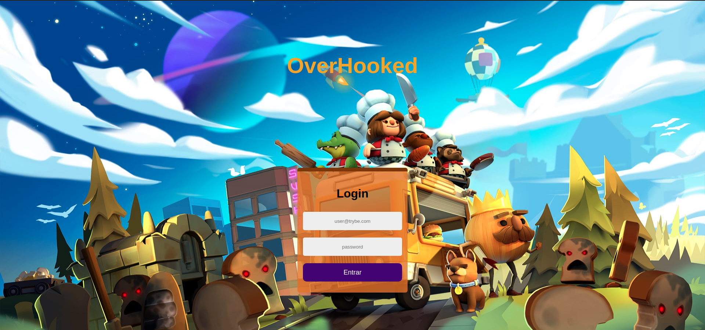
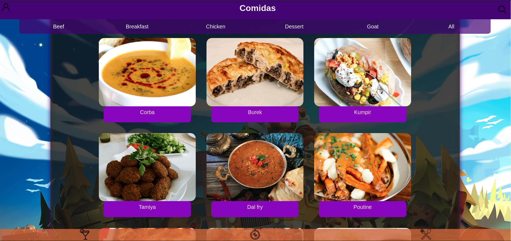
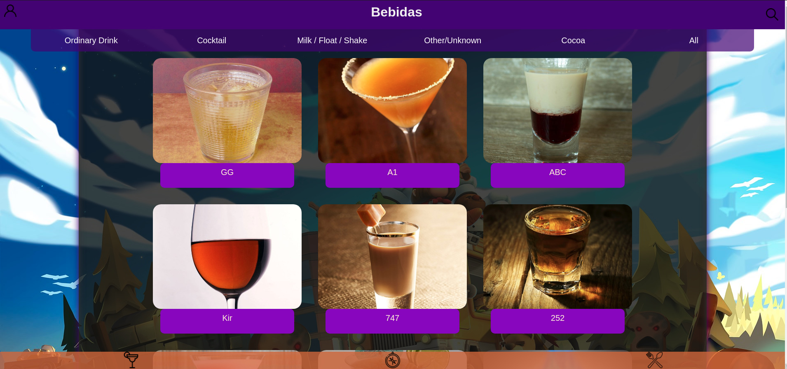

# Boas vindas ao repositório do projeto de Receitas!

## Sobre o projeto

Esta é uma aplicação Web de receitas. Será utilizando o que há de mais moderno dentro do ecossistema React: Hooks e Context API!

Nela será possível ver, buscar, filtrar, favoritar e acompanhar o processo de preparação de receitas e drinks!

A base de dados serão 2 APIs distintas, uma para comidas e outra para bebidas.

## Layout

<h1 align="center">
  
  
  
</h1>

---

# Requisitos Obrigatórios

- Requisitos do projeto

  - Lista de requisitos
    - 1 - Desenvolva os testes unitários de maneira que a seja de, no mínimo, 90%
    

      
Tela de Login

  
        - 2 - Crie todos os elementos que devem respeitar os atributos descritos no protótipo para a tela de login
        - 3 - Desenvolva a tela de maneira que a pessoa deve conseguir escrever seu email no input de email
        - 4 - Desenvolva a tela de maneira que a pessoa deve conseguir escrever sua senha no input de senha
        - 5 - Desenvolva a tela de maneira que o formulário só seja válido após um email válido e uma senha de mais de 6 caracteres serem       preenchidos
        - 6 - Salve 2 tokens no localStorage após a submissão, identificados pelas chaves mealsToken e cocktailsToken
        - 7 - Salve o e-mail da pessoa usuária no localStorage na chave user após a submissão
        - 8 - Redirecione a pessoa usuária para a tela principal de receitas de comidas após a submissão e validação com sucesso do login
    

    

      
Header

    - 9 - Implemente os elementos do header na tela principal de receitas, respeitando os atributos descritos no protótipo
    - 10 - Implemente um ícone para a tela de perfil, um título e um ícone para a busca, caso exista no protótipo
    - 11 - Redirecione a pessoa usuária para a tela de perfil ao clicar no botão de perfil
    - 12 - Desenvolva o botão de busca que, ao ser clicado, a barra de busca deve aparecer. O mesmo serve para escondê-la
    

    

      
Barra de busca

    - 13 - Implemente os elementos da barra de busca respeitando os atributos descritos no protótipo
    - 14 - Posicione a barra logo abaixo do header e implemente 3 radio buttons: Ingrediente, Nome e Primeira letra
    - 15 - Busque na API de comidas caso a pessoa esteja na página de comidas e na de bebidas caso esteja na de bebidas
    - 16 - Redirecione para a tela de detalhes da receita caso apenas uma receita seja encontrada, com o ID da mesma na URL
    - 17 - Mostre as receitas em cards caso mais de uma receita seja encontrada
    - 18 - Exiba um `alert` caso nenhuma receita seja encontrada
    

    

      
Menu inferior

    - 19 - Implemente os elementos do menu inferior respeitando os atributos descritos no protótipo
    - 20 - Posicione o menu inferior de forma fixa e apresente 3 ícones: um para comidas, um para bebidas e outro para exploração
    - 21 - Exiba o menu inferior apenas nas telas indicadas pelo protótipo
    - 22 - Redirecione a pessoa usuária para uma lista de cocktails ao clicar no ícone de bebidas
    - 23 - Redirecione a pessoa usuária para a tela de explorar ao clicar no ícone de exploração
    - 24 - Redirecione a pessoa usuárua para uma lista de comidas ao clicar no ícone de comidas
    

    

      
Tela principal de receitas

    - 25 - Implemente os elementos da tela principal de receitas respeitando os atributos descritos no protótipo
    - 26 - Carregue as 12 primeiras receitas de comidas ou bebidas, uma em cada card
    - 27 - Implemente os botões de categoria para serem utilizados como filtro
    - 28 - Implemente o filtro das receitas através da API ao clicar no filtro de categoria
    - 29 - Implemente o filtro como um toggle, que se for selecionado de novo, o app deve retornar as receitas sem nenhum filtro
    - 30 - Implemente o filtro de categoria para que apenas um seja selecionado por vez
    - 31 - Desenvolva o filtro de categorias com a opção de filtrar por todas as categorias
    - 32 - Redirecione a pessoa usuária, ao clicar no card, para a tela de detalhes, que deve mudar a rota e conter o id da receita na URL
    

    

      
Tela de detalhes de uma receita

    - 33 - Implemente os elementos da tela de detalhes de uma receita respeitando os atributos descritos no protótipo
    - 34 - Realize uma request para a API passando o `id` da receita que deve estar disponível nos parâmetros da URL
    - 35 - Desenvolva a tela de forma que contenha uma imagem da receita, o título, a categoria (ou se é ou não alcoólico), uma lista de  ingredientes seguidos pelas quantidades, instruções, um vídeo do youtube "embedado" e recomendações
    - 36 - Implemente as recomendações, para receitas de comida, a recomendação deverá ser bebida e vice-versa
    - 37 - Implemente os cards de recomendação, onde serão 6 cards, mas mostrando apenas 2 e o scroll é horizontal, similar a um `carousel`
    - 38 - Desenvolva um botão de nome "Iniciar Receita" que deve ficar fixo na parte de baixo da tela o tempo todo
    - 39 - Implemente a solução de forma que caso a receita já tenha sido feita, o botão "Iniciar Receita" deve sumir
    - 40 - Implemente a solução de modo que caso a receita tenha sido iniciada mas não finalizada, o texto do botão deve ser "Continuar   Receita"
    - 41 - Redirecione a pessoa usuário caso o botão "Iniciar Receita" seja clicado, a rota deve mudar para a tela de receita em processo
    - 42 - Implemente um botão de compartilhar e um de favoritar a receita
    - 43 - Implemente a solução de forma que, ao clicar no botão de compartilhar, o link da receita dentro do app deve ser copiado para o   clipboard e uma mensagem avisando que o link foi copiado deve aparecer
    - 44 - Implemente o ícone do coração (favorito) de maneira que, deve vir preenchido caso a receita esteja favoritada e "despreenchido"  caso contrário
    - 45 - Implemente a lógica no botão de favoritar, caso seja clicado, o ícone do coração deve mudar seu estado atual, caso esteja  preenchido deve mudar para "despreenchido" e vice-versa
    - 46 - Salve as receitas favoritas no `localStorage` na chave `favoriteRecipes`
    

    

      
Tela de receita em progresso

    - 47 - Desenvolva a tela de maneira que contenha uma imagem da receita, seu titulo, sua categoria (ou se a bebida é alcoólica ou não)   uma lista de ingredientes com suas respectivas quantidade e suas instruções
    - 48 - Desenvolva um checkbox para cada item da lista de ingredientes
    - 49 - Implemente uma lógica que, ao clicar no checkbox de um ingrediente, o nome dele deve ser "riscado" da lista
    - 50 - Salve o estado do progresso, que deve ser mantido caso a pessoa atualize a página ou volte para a mesma receita
    - 51 - Desenvolva a lógica de favoritar e compartilhar, a lógica da tela de detalhes de uma receita se aplica aqui
    - 52 - Implemente a solução de maneira que o botão de finalizar receita só pode estar habilitado quando todos os ingredientes estiverem   _"checkados"_ (marcados)
    - 53 - Redirecione a pessoa usuária após clicar no botão "Finalizar receita", para a página de receitas feitas, cuja rota deve ser `/ receitas-feitas`
    

    

      
Tela de receitas feitas

    - 54 - Implemente os elementos da tela de receitas feitas respeitando os atributos descritos no protótipo
    - 55 - Desenvolva a tela de maneira que, caso a receita do card seja uma comida, ela deve possuir: a foto da receita, o nome, a   categoria, a area, a data em que a pessoa fez a receita, as 2 primeiras tags retornadas pela API e um botão de compartilhar
    - 56 - Desenvolva a tela de maneira que, caso a receita do card seja uma bebida, ela deve possuir: a foto da receita, o nome, se é  alcoólica, a data em que a pessoa fez a receita e um botão de compartilhar
    - 57 - Desenvolva a solução de maneira que o botão de compartilhar deve copiar a URL da tela de detalhes da receita para o clipboard
    - 58 - Implemente 2 botões que filtram as receitas por comida ou bebida e um terceiro que remove todos os filtros
    - 59 - Redirecione para a tela de detalhes da receita caso seja clicado na foto ou no nome da receita
    

    

      
Tela de receitas favoritas

    - 60 - Implemente os elementos da tela de receitas favoritas (cumulativo com os atributos em comum com a tela de receitas feitas)   respeitando os atributos descritos no protótipo
    - 61 - Desenvolva a tela de maneira que, caso a receita do card seja uma comida, ela deve possuir: a foto da receita, o nome, a   categoria, a area, um botão de compartilhar e um de "desfavoritar"
    - 62 - Desenvolva a tela de maneira que, caso a receita do card seja uma bebida, ela deve possuir: a foto da receita, o nome, se é  alcoólica ou não, um botão de compartilhar e um de "desfavoritar"
    - 63 - Desenvolva a solução de maneira que o botão de compartilhar deve copiar a URL da tela de detalhes da receita para o clipboard
    - 64 - Desenvolva a solução de maneira que o botão de "desfavoritar" deve remover a receita da lista de receitas favoritas do   `localStorage` e da tela
    - 65 - Implemente 2 botões que filtram as receitas por comida ou bebida e um terceiro que remove todos os filtros
    - 66 - Redirecione a pessoa usuária ao clicar na foto ou no nome da receita, a rota deve mudar para a tela de detalhes daquela receita
    

    

      
Tela de explorar

    - 67 - Implemente os elementos da tela de explorar respeitando os atributos descritos no protótipo
    - 68 - Desenvolva a tela de maneira que tenha 2 botões: um para explorar comidas e o outro para explorar bebidas
    - 69 - Redirecione a pessoa usuária ao clicar em um dos botões, a rota deve mudar para a página de explorar comidas ou de explorar  bebidas

    

    

      
Tela de explorar bebidas ou comidas

    - 70 - Implemente os elementos da tela de explorar bebidas ou comidas respeitando os atributos descritos no protótipo
    - 71 - Desenvolva 3 botões: um para explorar por ingrediente, um para explorar por local de origem e um para pegar uma receita aleatória
    - 72 - Redirecione a pessoa usuária ao clicar em "Por Ingredientes", a rota deve mudar para a tela de explorar por ingredientes
    - 73 - Redirecione a pessoa usuária ao clicar em "Por Local de Origem", a rota deve mudar para tela de explorar por local de origem
    - 74 - Redirecione a pessoa usuária ao clicar em "Me Surpreenda!", a rota deve mudar para a tela de detalhes de uma receita, que deve   ser escolhida de forma aleatória através da API
    

    

      
Tela de explorar ingredientes

    - 75 - Implemente os elementos da tela de explorar ingredientes respeitando os atributos descritos no protótipo
    - 76 - Desenvolva cards para os 12 primeiros ingredientes, de forma que cada card contenha o nome do ingrediente e uma foto
    - 77 - Redireciona a pessoa usuária ao clicar no card do ingrediente, a rota deve mudar para tela principal de receitas mas mostrando   apenas as receitas que contém o ingrediente escolhido
    

    

      
Tela de explorar por local de origem/area

        - 78 - Implemente os elementos da tela de explorar por local de origem respeitando os atributos descritos no protótipo
        - 79 - Desenvolva as mesmas especificações da tela de receitas principal, com a diferença de que os filtros de categoria são      substituídos por um dropdown
        - 80 - Implemente o dropdown de maneira que devem estar disponíveis todas as áreas retornadas da API, incluindo a opção "All", que      retorna as receitas sem nenhum filtro
        - 81 - Implemente a rota que deve ser apenas `/explorar/comidas/area`
    

    

      
Tela de perfil

    - 82 - Implemente os elementos da a tela de perfil respeitando os atributos descritos no protótipo
    - 83 - Implemente a solução de maneira que o e-mail da pessoa usuária deve estar visível
    - 84 - Implemente 3 botões: um de nome "Receitas Feitas", um de nome "Receitas Favoritas" e um de nome "Sair"
    - 85 - Redirecione a pessoa usuária que, ao clicar no botão de "Receitas Favoritas", a rota deve mudar para a tela de receitas favoritas
    - 86 - Redirecione a pessoa usuária que, ao clicar no botão de "Receitas Feitas", a rota deve mudar para a tela de receitas feitas
    - 87 - Redirecione a pessoa usuária que, ao clicar no botão de "Sair", o `localStorage` deve ser limpo e a rota deve mudar para a tela  de login
    

---

# Habilidades

Nesse projeto utilizamos:

- Redux para gerenciar estado
- Biblioteca React-Redux
- Context API do React para gerenciar estado
- React Hook useState
- React Hook useContext
- React Hook useEffect
- Criar Hooks customizados

---

### Protótipo do projeto

Você pode acessar um protótipo no link abaixo:

https://www.figma.com/file/WatDxtKl7g54QxhDi9qdbq/App-Receitas?node-id=0%3A1

## Proximos Passos

- Modernizar a interface para melhorar a esperiencia do usuário